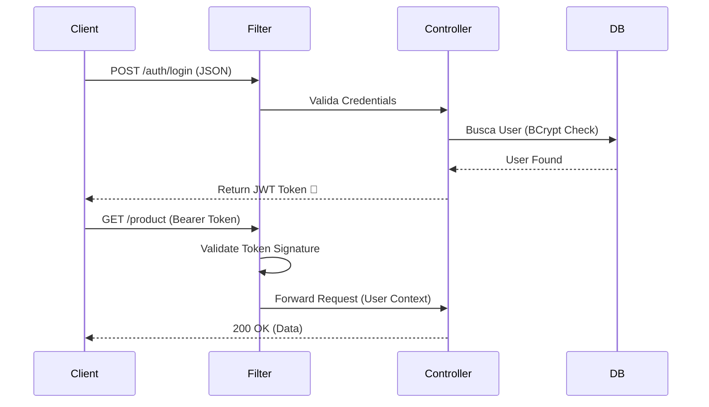

# Auth API (Spring Security + JWT)

API de Autenticação Robusta desenvolvida com as melhores práticas de segurança do mercado (Stateless, RBAC).

## Tecnologias
- **Java 21** (LTS)
- **Spring Boot 3**
- **Spring Security 6** (Filter Chain, Lambda DSL)
- **JWT (JSON Web Token)** via Auth0
- **Swagger / OpenAPI**
- **PostgreSQL** (Docker)
- **BCrypt** (Password Hashing)

## Arquitetura de Segurança
O sistema implementa o padrão **Stateless Authentication**:

1.  **Filter Chain:** Interceptação de requisições via `OncePerRequestFilter`.
2.  **Token Validation:** Decodificação e verificação de assinatura HMAC256.
3.  **RBAC (Role-Based Access Control):**
    - `ADMIN`: Acesso total (CRUD).
    - `USER`: Acesso somente leitura.

### Fluxo de Autenticação

## Documentação da API (Swagger)
O projeto conta com documentação automática via **Swagger UI**.
Após subir a aplicação, acesse:

> **[http://localhost:8080/swagger-ui/index.html](http://localhost:8080/swagger-ui/index.html)**

Lá você pode testar todas as rotas (`/auth/login`, `/product`, etc) diretamente pelo navegador, sem precisar configurar o Postman.

## Como Rodar?

**Suba o Banco de Dados (Docker):**
```bash
Bash - 
docker-compose up -d
```
**Execute a aplicação (IntelliJ ou Maven):**
```bash
Bash-
./mvnw spring-boot:run
```
**Teste os Endpoints no Postman:**
```bash
POST /auth/register (Criar conta)

POST /auth/login (Pegar Token)

GET /product (Usar Token no Header Authorization)
```